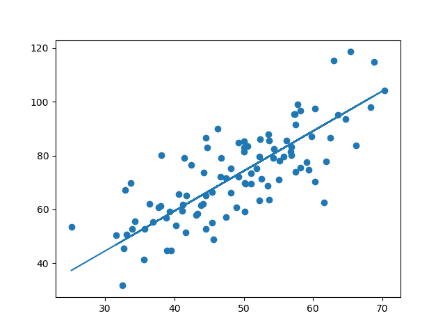

# linear_regression_live
This is the code for the "[How to Do Linear Regression the Right Way](https://youtu.be/uwwWVAgJBcM)" live session by Siraj Raval on Youtube.

Siraj's Git repo here : [llSourcell/linear_regression_demo](https://github.com/llSourcell/linear_regression_demo)


## Overview
Siraj used a small dataset of student test scores and the amount of hours they studied. Intuitively, there must be a relationship right? The more you study, the better your test scores should be. We're going to use [linear regression](http://onlinecourses.science.psu.edu/stat501/node/250) to prove this relationship

I've modified his code for better understanding


## Dependencies
* [numpy](http://pypi.org/project/numpy) - Used to manipulate numerical arrays
* [matplotlib](http://pypi.org/project/matplotlib) - This is used to plot charts to visualise the trend line

## Usage
Just run `demo.py` program with any python-3 interpreter. Make sure 'data.csv' is in same path

#### Graphical Visualization :


#### Initial values :
```
intercept = 0
slope = 0
error = 72.7350505539
```

#### Values After 1000 itterations :
```
intercept = 0.00030345097633355256
slope = 1.4856456516193968
error = 5.186961971048731e-15
```

- - - -
mail me @ nagasai.g9@gmail.com
making world a better palce with open source
